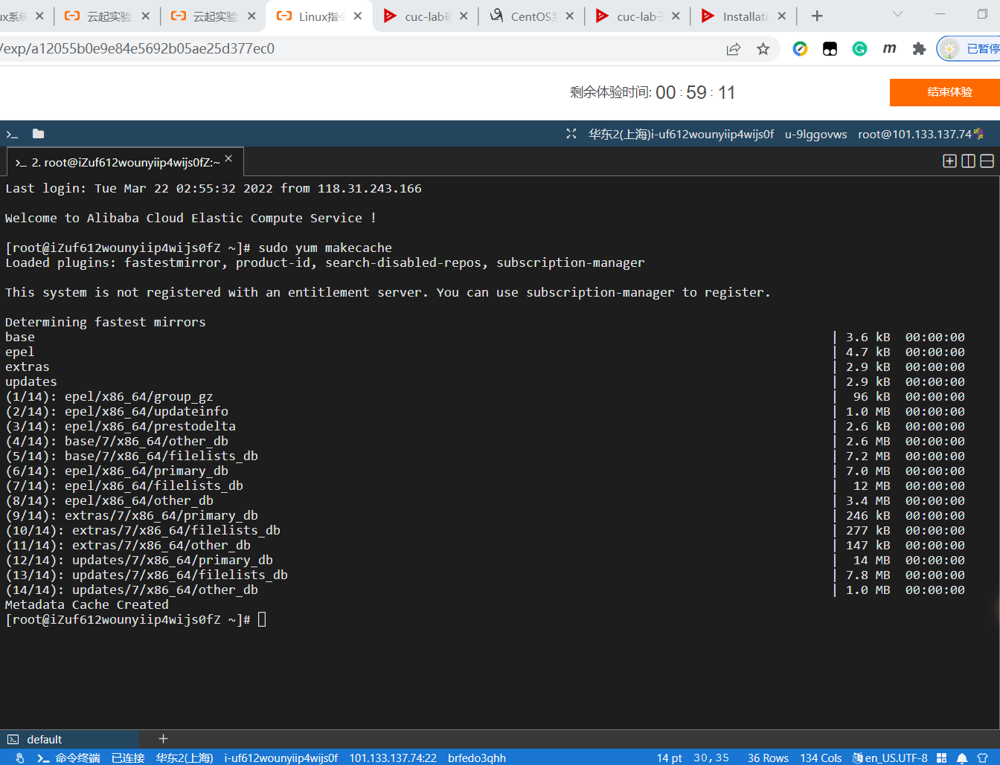
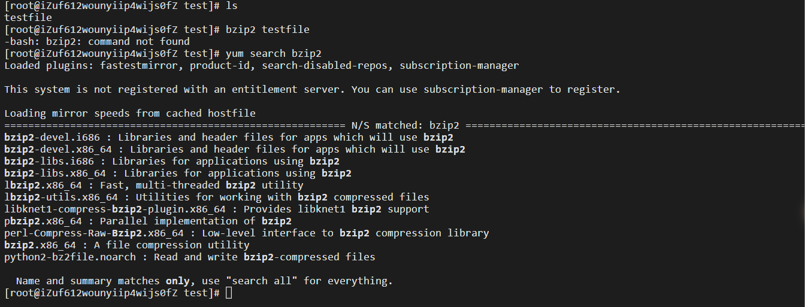
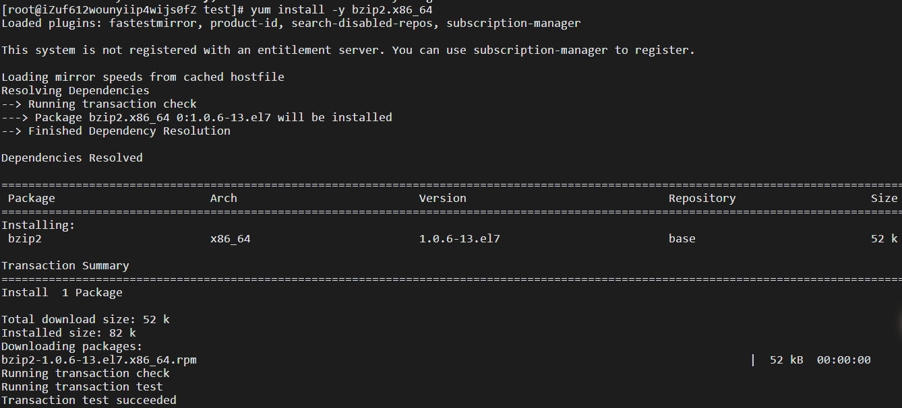

# 第二次实验

## 1.实验过程记录

### 实验内容：

- 【软件包管理】在目标发行版上安装 `tmux` 和 `tshark` ；查看这 2 个软件被安装到哪些路径；卸载 `tshark` ；验证 `tshark` 卸载结果

- 【文件管理】复制以下`shell`代码到终端运行，在目标 Linux 发行版系统中构造测试数据集，然后回答以下问题：
  - 找到 `/tmp` 目录及其所有子目录下，文件名包含 `666` 的所有文件
  - 找到 `/tmp` 目录及其所有子目录下，文件内容包含 `666` 的所有文件

```shell
cd /tmp && for i in $(seq 0 1024);do dir="test-$RANDOM";mkdir "$dir";echo "$RANDOM" > "$dir/$dir-$RANDOM";done
```

- 【文件压缩与解压缩】练习课件中 [文件压缩与解压缩](https://c4pr1c3.github.io/LinuxSysAdmin/chap0x02.md.html#/12/1) 一节所有提到的压缩与解压缩命令的使用方法

- 【跟练】 [子进程管理实验](https://asciinema.org/a/f3ux5ogwbxwo2q0wxxd0hmn54)

- 【硬件信息获取】目标系统的 CPU、内存大小、硬盘数量与硬盘容量

### 过程视频：

|                  | Ubuntu 20.04                                                 | CentOS 7.7.1908                                              |
| ---------------- | ------------------------------------------------------------ | ------------------------------------------------------------ |
| 软件包管理       | [](https://asciinema.org/a/sBYrFuAbbydOupZ9I8EwuycPj) | [](https://asciinema.org/a/ufUiQoaWpzAvVKxxFCnfil3B7) |
| 文件管理         | [](https://asciinema.org/a/PnDWYn7XJmA6dJo0jBqNwg12x) | [](https://asciinema.org/a/gpc6gWiFpSgdRtQDUG3nTgpdh) |
| 文件压缩与解压缩 | [](https://asciinema.org/a/svikBE8RxX3nkCjkDrSbQS4BJ) | [](https://asciinema.org/a/FfTLbM9T5rvuQ0zRZd0zGfQ60) |
| 子进程管理       | [](https://asciinema.org/a/CutLQ9Y3VxM6CBmHBp4NrvBSd) | [](https://asciinema.org/a/p6LH4eCNbYUz4gZemTLswaPlT) |
| 硬件信息获取     | [](https://asciinema.org/a/Y8JLDv1baRmzvFtsnyJ7wWGPW) | [](https://asciinema.org/a/26UVRYEjjsmOLRyTVxa7BmKmv) |


## 2.命令对比与总结

### 2.1软件包管理

#### 2.1.1.更新镜像源

Ubuntu中：

```shell
apt-get update #使用/etc/apt/sources.list中的镜像源地址更新可用软件列表，不更新软件
apt-get upgrade #更新所有已安装软件
apt-get dist-upgrade #更新所有软件+自动推导依赖关系

#现在不太用apt-get了，用apt即可
```

CentOS中：

```shell
yum list updates #列出可更新的软件包
yum info updates #列出可更新的软件包信息
yum deplist name #查询*软件包的依赖关系
```

#### 2.1.2.安装软件

Ubuntu中：

```shell
apt install name #安装镜像源里的软件
dpkg -i name.deb #安装不在镜像源里面,只有deb包的软件
```

CentOS中：

```shell
yum install name
rpm -ivh name.rpm
```

#### 2.1.3.查看软件安装位置

Ubuntu中：

```shell
dpkg -l name #dpkg查看软件安装的相关信息
where is name
which name
```

CentOS中：

```shell
yum search name #yum查询
rpm -qal |grep name #rpm查看所有安装包的文件存储位置
where is name
which name
```

#### 2.1.4.卸载软件

Ubuntu中：

```shell
apt remove name #卸载，保留配置
apt purge name #卸载，删除配置
apt clean name #删除缓存文件
apt autoremove name #卸载并移除依赖
dpkg -r name #卸载，保留配置
dpkg -P name #卸载，不保留配置
```

CentOS中：

```shell
yum -y remove name
rpm -e name.rpm
```


### 2.2文件管理

#### 2.2.1查找文件名

Ubuntu和CentOS共用

```shell
find / -name "*name*"
```

#### 2.2.2 查找文件内容

Ubuntu

```shell
grep -r "name"./
```

CentOS

```shell
find .| xargs grep -ri "666"
```


### 2.3压缩与解压缩

Ubuntu:

```shell
#gzip
gzip TEST #压缩后，不保留源文件
gzip -d TEST.gz #解压后，不保留压缩文件

#bzip2
bzip2 TEST #压缩后，不保留源文件
bzip2 -d TEST.bz2 #解压后，不保留压缩文件

#zip
zip TEST.zip TEST #压缩后，保留源文件
unzip TEST.zip #解压后，保留压缩文件

#tar
tar -zcvf TEST.tgz TEST #压缩后，保留源文件
tar -zxvf test.tgz #解压后，保留压缩文件

#7zr
7zr a -t7z TEST.7Z * #还可以添加-r参数 表示级联压缩
#压缩后，保留源文件
7zr x TEST.7z #解压后，保留压缩文件

#rar
rar x TEST.rar #解压后，保留压缩文件

```

CentOS:

```shell
#gzip
gzip TEST
gzip -d TEST.gz
#bzip2
bzip2 TEST
bzip2 -d TEST.bz2
#zip
zip TEST.zip TEST
unzip TEST.zip
#tar
tar -zcvf TEST.tgz TEST
tar -zxvf test.tgz
#7zr
7za a -t7z TEST.7Z * #注意，与ubuntu有所不同哦
7za x TEST.7z
#rar
rar x TEST.rar
```

使用`7zr`命令需要安装`p7zip`

使用`rar`命令需要安装`rarlinux`


### 2.4硬件信息获取

Ubuntu

```shell
lscpu #查看CPU信息
free -m #内存信息
sudo fdisk -l |grep "Disk /dev/sd" # 硬盘数量和大小
```

CentOS

```shell
cat /proc/cpuinfo # 查看CPU信息
free -m # 查看内存情况
df -hl # 查看磁盘剩余空间
df -h # 查看每个根路径的分区大小
```


## 3.实验中出现的问题及解决方案

#### 问题：

在使用CentOS完成实验的过程中，发现许多压缩、解压文件所需的软件默认都没有下载。输入命令后提示：command not found。

#### 解决（以bzip2为例）：

首先，使用

```shell
yum makecache
```

把服务器的包信息下载到本地电脑缓存起来：



接着使用

```shell
yum search bzip2
```

查找与`bzip2`命令相关的包，并且获得我们可能需要的软件名列表：



再使用

```shell
yum install -y bzip2.x86_64
```

来安装我们需要的x86_64版本的bzip2。安装成功后界面如下：




## 4.参考链接

[查看CPU信息](https://www.cnblogs.com/mafeng/p/6558941.html)

[yum教程](https://www.runoob.com/linux/linux-yum.html)

[Ubuntu文件系统与文件管理](https://blog.csdn.net/Dawn510/article/details/82822738)

[常用apt命令](https://blog.csdn.net/aqtata/article/details/80277659)