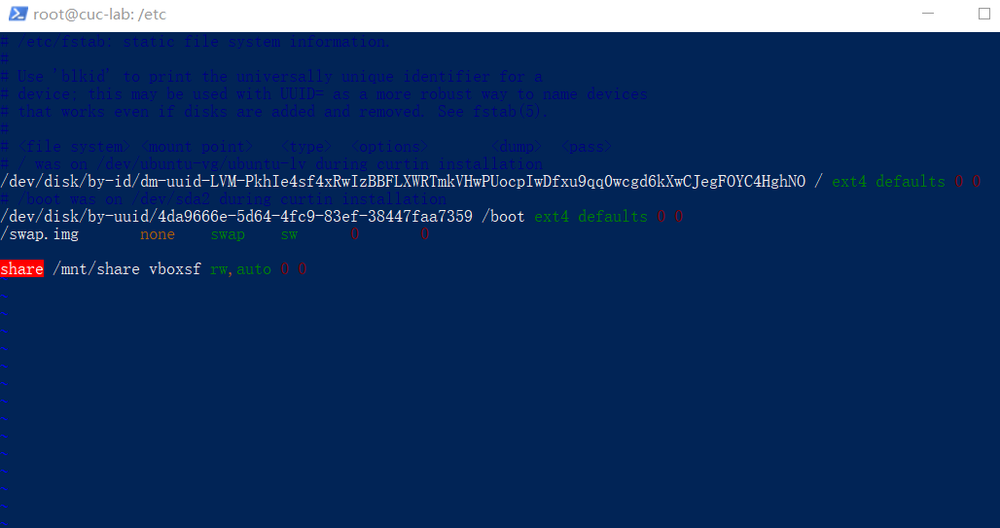

# chap0x03

## 0.实验环境

系统环境：Windows 10 家庭中文版 21H2 内部版本号19044.1586

虚拟机软件版本：VirtualBox 6.1.32 r149290（Qt 5.6.2）

部分情况下在Power Shell中使用SSH连接到虚拟机进行实验。

## 1.实验任务

- 完成[Systemd 入门教程：命令篇](http://www.ruanyifeng.com/blog/2016/03/systemd-tutorial-commands.html)

- 完成[Systemd 入门教程：实战篇](http://www.ruanyifeng.com/blog/2016/03/systemd-tutorial-part-two.html)

- 回答自查清单
  - 如何添加一个用户并使其具备sudo执行程序的权限？

  - 如何将一个用户添加到一个用户组？

  - 如何查看当前系统的分区表和文件系统详细信息？

  - 如何实现开机自动挂载Virtualbox的共享目录分区？

  - 基于LVM（逻辑分卷管理）的分区如何实现动态扩容和缩减容量？

  - 如何通过systemd设置实现在网络连通时运行一个指定脚本，在网络断开时运行另一个脚本？

  - 如何通过systemd设置实现一个脚本在任何情况下被杀死之后会立即重新启动？实现杀不死？


## 2. Systemd 入门教程：命令篇

- 查看Systemd版本

  ```bash
  $ sudo systemctl --version
  ```

  [](https://asciinema.org/a/2fkWFkBKLghYW79DdIFuRPYI4)

- `systemd-analyze`命令用于查看启动耗时。

  > ```bash
  > # 查看启动耗时
  > $ systemd-analyze           
  > 
  > # 查看每个服务的启动耗时
  > $ systemd-analyze blame
  > 
  > # 显示瀑布状的启动过程流
  > $ systemd-analyze critical-chain
  > 
  > # 显示指定服务的启动流
  > $ systemd-analyze critical-chain atd.service
  > ```

  [](https://asciinema.org/a/WKKjMh1MG7yZfTUJcw6wFIGra)

- `hostnamectl`命令用于查看当前主机的信息。

  > ```bash
  > # 显示当前主机的信息
  > $ hostnamectl
  > 
  > # 设置主机名。
  > $ sudo hostnamectl set-hostname rhel7
  > ```

  [](https://asciinema.org/a/CxBCxspjgRJ0Db5uVCohFyS9i)

- `localectl`命令用于查看本地化设置。

  > ```bash
  > # 查看本地化设置
  > $ localectl
  > 
  > # 设置本地化参数。
  > $ sudo localectl set-locale LANG=en_GB.utf8
  > $ sudo localectl set-keymap en_GB
  > ```

  [](https://asciinema.org/a/dJimAHDpU2c5Lv7gIhrlaJRFA)

- `timedatectl`命令用于查看当前时区设置。

  > ```bash
  > # 查看当前时区设置
  > $ timedatectl
  > 
  > # 显示所有可用的时区
  > $ timedatectl list-timezones                                                                                   
  > 
  > # 设置当前时区
  > $ sudo timedatectl set-timezone America/New_York
  > $ sudo timedatectl set-time YYYY-MM-DD
  > $ sudo timedatectl set-time HH:MM:SS
  > ```

  [](https://asciinema.org/a/i4Z4Af3ZAqwntBRIFnBTzJVBc)

- `loginctl`命令用于查看当前登录的用户。

  > ```bash
  > # 列出当前session
  > $ loginctl list-sessions
  > 
  > # 列出当前登录用户
  > $ loginctl list-users
  > 
  > # 列出显示指定用户的信息
  > $ loginctl show-user ruanyf
  > ```

  [](https://asciinema.org/a/v86thVdKg7OMNRrwCDK4ZAYQL)

- `systemctl list-units`命令可以查看当前系统的所有 Unit 。

  > ```bash
  > # 列出正在运行的 Unit
  > $ systemctl list-units
  > 
  > # 列出所有Unit，包括没有找到配置文件的或者启动失败的
  > $ systemctl list-units --all
  > 
  > # 列出所有没有运行的 Unit
  > $ systemctl list-units --all --state=inactive
  > 
  > # 列出所有加载失败的 Unit
  > $ systemctl list-units --failed
  > 
  > # 列出所有正在运行的、类型为 service 的 Unit
  > $ systemctl list-units --type=service
  > ```

  [](https://asciinema.org/a/KfFegzXkbj70YTThv1FjvBZoY)

- `systemctl status`命令用于查看系统状态和单个 Unit 的状态。

  > ```bash
  > # 显示系统状态
  > $ systemctl status
  > 
  > # 显示单个 Unit 的状态
  > $ sysystemctl status bluetooth.service
  > 
  > # 显示远程主机的某个 Unit 的状态
  > $ systemctl -H root@rhel7.example.com status httpd.service
  > ```

  [](https://asciinema.org/a/VjQ7pkZopcUVWgOlv18pJe3he)

- 除了`status`命令，`systemctl`还提供了三个查询状态的简单方法，主要供脚本内部的判断语句使用。

  > ```bash
  > # 显示某个 Unit 是否正在运行
  > $ systemctl is-active application.service
  > 
  > # 显示某个 Unit 是否处于启动失败状态
  > $ systemctl is-failed application.service
  > 
  > # 显示某个 Unit 服务是否建立了启动链接
  > $ systemctl is-enabled application.service
  > ```

  [](https://asciinema.org/a/YvVyLfch4hfm1rjUwYKC8Fgwv)

- 对于用户来说，最常用的是下面这些命令，用于启动和停止 Unit（主要是 service）。

  > ```bash
  > # 立即启动一个服务
  > $ sudo systemctl start apache.service
  > 
  > # 立即停止一个服务
  > $ sudo systemctl stop apache.service
  > 
  > # 重启一个服务
  > $ sudo systemctl restart apache.service
  > 
  > # 杀死一个服务的所有子进程
  > $ sudo systemctl kill apache.service
  > 
  > # 重新加载一个服务的配置文件
  > $ sudo systemctl reload apache.service
  > 
  > # 重载所有修改过的配置文件
  > $ sudo systemctl daemon-reload
  > 
  > # 显示某个 Unit 的所有底层参数
  > $ systemctl show httpd.service
  > 
  > # 显示某个 Unit 的指定属性的值
  > $ systemctl show -p CPUShares httpd.service
  > 
  > # 设置某个 Unit 的指定属性
  > $ sudo systemctl set-property httpd.service CPUShares=500
  > ```

  [](https://asciinema.org/a/EKQu9ERkZAVthATkbINZQ2Gkx)

- Unit 之间存在依赖关系：A 依赖于 B，就意味着 Systemd 在启动 A 的时候，同时会去启动 B。

  `systemctl list-dependencies`命令列出一个 Unit 的所有依赖。

  > ```bash
  > $ systemctl list-dependencies nginx.service
  > ```

  上面命令的输出结果之中，有些依赖是 Target 类型（详见下文），默认不会展开显示。如果要展开 Target，就需要使用`--all`参数。

  > ```bash
  > $ systemctl list-dependencies --all nginx.service
  > ```

  [](https://asciinema.org/a/aGBzztAoj4Yx6vGRaNsKs4pI9)

- `systemctl list-unit-files`命令用于列出所有配置文件。

  > ```bash
  > # 列出所有配置文件
  > $ systemctl list-unit-files
  > 
  > # 列出指定类型的配置文件
  > $ systemctl list-unit-files --type=service
  > ```

  [](https://asciinema.org/a/NyNnzYi1LHNvmu2wy2LvTXx9Q)

- 传统的`init`启动模式里面，有 RunLevel 的概念，跟 Target 的作用很类似。不同的是，RunLevel 是互斥的，不可能多个 RunLevel 同时启动，但是多个 Target 可以同时启动。

  > ```bash
  > # 查看当前系统的所有 Target
  > $ systemctl list-unit-files --type=target
  > 
  > # 查看一个 Target 包含的所有 Unit
  > $ systemctl list-dependencies multi-user.target
  > 
  > # 查看启动时的默认 Target
  > $ systemctl get-default
  > 
  > # 设置启动时的默认 Target
  > $ sudo systemctl set-default multi-user.target
  > 
  > # 切换 Target 时，默认不关闭前一个 Target 启动的进程，
  > # systemctl isolate 命令改变这种行为，
  > # 关闭前一个 Target 里面所有不属于后一个 Target 的进程
  > $ sudo systemctl isolate multi-user.target
  > ```

  [](https://asciinema.org/a/GdubAqkPU6LZi1qnkm6Smbhpu)

- Systemd 统一管理所有 Unit 的启动日志。带来的好处就是，可以只用`journalctl`一个命令，查看所有日志（内核日志和应用日志）。日志的配置文件是`/etc/systemd/journald.conf`。

  `journalctl`功能强大，用法非常多。

  > ```bash
  > # 查看所有日志（默认情况下 ，只保存本次启动的日志）
  > $ sudo journalctl
  > 
  > # 查看内核日志（不显示应用日志）
  > $ sudo journalctl -k
  > 
  > # 查看系统本次启动的日志
  > $ sudo journalctl -b
  > $ sudo journalctl -b -0
  > 
  > # 查看上一次启动的日志（需更改设置）
  > $ sudo journalctl -b -1
  > 
  > # 查看指定时间的日志
  > $ sudo journalctl --since="2012-10-30 18:17:16"
  > $ sudo journalctl --since "20 min ago"
  > $ sudo journalctl --since yesterday
  > $ sudo journalctl --since "2015-01-10" --until "2015-01-11 03:00"
  > $ sudo journalctl --since 09:00 --until "1 hour ago"
  > 
  > # 显示尾部的最新10行日志
  > $ sudo journalctl -n
  > 
  > # 显示尾部指定行数的日志
  > $ sudo journalctl -n 20
  > 
  > # 实时滚动显示最新日志
  > $ sudo journalctl -f
  > 
  > # 查看指定服务的日志
  > $ sudo journalctl /usr/lib/systemd/systemd
  > 
  > # 查看指定进程的日志
  > $ sudo journalctl _PID=1
  > 
  > # 查看某个路径的脚本的日志
  > $ sudo journalctl /usr/bin/bash
  > 
  > # 查看指定用户的日志
  > $ sudo journalctl _UID=33 --since today
  > 
  > # 查看某个 Unit 的日志
  > $ sudo journalctl -u nginx.service
  > $ sudo journalctl -u nginx.service --since today
  > 
  > # 实时滚动显示某个 Unit 的最新日志
  > $ sudo journalctl -u nginx.service -f
  > 
  > # 合并显示多个 Unit 的日志
  > $ journalctl -u nginx.service -u php-fpm.service --since today
  > 
  > # 查看指定优先级（及其以上级别）的日志，共有8级
  > # 0: emerg
  > # 1: alert
  > # 2: crit
  > # 3: err
  > # 4: warning
  > # 5: notice
  > # 6: info
  > # 7: debug
  > $ sudo journalctl -p err -b
  > 
  > # 日志默认分页输出，--no-pager 改为正常的标准输出
  > $ sudo journalctl --no-pager
  > 
  > # 以 JSON 格式（单行）输出
  > $ sudo journalctl -b -u nginx.service -o json
  > 
  > # 以 JSON 格式（多行）输出，可读性更好
  > $ sudo journalctl -b -u nginx.serviceqq
  >  -o json-pretty
  > 
  > # 显示日志占据的硬盘空间
  > $ sudo journalctl --disk-usage
  > 
  > # 指定日志文件占据的最大空间
  > $ sudo journalctl --vacuum-size=1G
  > 
  > # 指定日志文件保存多久
  > $ sudo journalctl --vacuum-time=1years
  > ```

  [](https://asciinema.org/a/KAkLzqKLnWNkQQvw4G5r8jqXL)

## 3. Systemd 入门教程：实战篇

### 3.1开机启动

对于那些支持 Systemd 的软件，安装的时候，会自动在`/usr/lib/systemd/system`目录添加一个配置文件。

如果你想让该软件开机启动，就执行下面的命令（以`httpd.service`为例）。

> ```bash
> $ sudo systemctl enable httpd
> ```

上面的命令相当于在`/etc/systemd/system`目录添加一个符号链接，指向`/usr/lib/systemd/system`里面的`httpd.service`文件。

这是因为开机时，`Systemd`只执行`/etc/systemd/system`目录里面的配置文件。这也意味着，如果把修改后的配置文件放在该目录，就可以达到覆盖原始配置的效果。

### 3.2启动服务

设置开机启动以后，软件并不会立即启动，必须等到下一次开机。如果想现在就运行该软件，那么要执行`systemctl start`命令。

> ```bash
> $ sudo systemctl start httpd
> ```

执行上面的命令以后，有可能启动失败，因此要用`systemctl status`命令查看一下该服务的状态。

### 3.3停止服务

终止正在运行的服务，需要执行`systemctl stop`命令。

> ```bash
> $ sudo systemctl stop httpd.service
> ```

有时候，该命令可能没有响应，服务停不下来。这时候就不得不"杀进程"了，向正在运行的进程发出`kill`信号。

> ```bash
> $ sudo systemctl kill httpd.service
> ```

此外，重启服务要执行`systemctl restart`命令。

> ```bash
> $ sudo systemctl restart httpd.service
> ```

[](https://asciinema.org/a/efkh9Nl9lZlpUXhYulx6KgyIc)

### 3.4 读懂配置文件

一个服务怎么启动，完全由它的配置文件决定。下面就来看，配置文件有些什么内容。

`systemctl cat`命令可以用来查看配置文件，下面以`sshd.service`文件为例，它的作用是启动一个 SSH 服务器，供其他用户以 SSH 方式登录。

[](https://asciinema.org/a/eO25iB5uHVA5OxuWVWUUNDn8E)

```bash
$ systemctl cat sshd.service                                                           
# /lib/systemd/system/ssh.service                                                       
[Unit]        
Description=OpenBSD Secure Shell server
Documentation=man:sshd(8) man:sshd_config(5)
After=network.target auditd.service
ConditionPathExists=!/etc/ssh/sshd_not_to_be_run       
[Service]                                
EnvironmentFile=-/etc/default/ssh
ExecStartPre=/usr/sbin/sshd -t       
ExecStart=/usr/sbin/sshd -D $SSHD_OPTS  
ExecReload=/usr/sbin/sshd -t          
ExecReload=/bin/kill -HUP $MAINPID   
KillMode=process           
Restart=on-failure     
RestartPreventExitStatus=255 
Type=notify  
RuntimeDirectory=sshd     
RuntimeDirectoryMode=0755 
[Install] 
WantedBy=multi-user.target 
Alias=sshd.service                       
```

- Unit区块：启动前后的顺序依赖关系

  ```bash
  [Unit]        
  Description=OpenBSD Secure Shell server
  Documentation=man:sshd(8) man:sshd_config(5)
  After=network.target auditd.service
  ConditionPathExists=!/etc/ssh/sshd_not_to_be_run 
  ```

  - Description: 当前服务的简单描述
  - Documentation：文档的位置
  - After：如果network.target和auditd.service这两个服务需要启动，sshd.service在它们之后启动
  - ConditionPathExists：检查这个路径是否存在，如果存在，就不启动服务

- Service区块：核心的控制语句

  ```bash
  [Service]                                
  EnvironmentFile=-/etc/default/ssh
  ExecStartPre=/usr/sbin/sshd -t       
  ExecStart=/usr/sbin/sshd -D $SSHD_OPTS  
  ExecReload=/usr/sbin/sshd -t          
  ExecReload=/bin/kill -HUP $MAINPID   
  KillMode=process           
  Restart=on-failure     
  RestartPreventExitStatus=255 
  Type=notify  
  RuntimeDirectory=sshd     
  RuntimeDirectoryMode=0755 
  ```

  - EnvironmentFile：指定当前服务的环境参数文件。
  - ExecStartPre字段：启动服务之前执行的命令
  - ExecStart：定义启动进程时执行的命令。
  - ExecReload：定义服务重载时执行的命令。
  - KillMode：定义 Systemd 如何停止 sshd 服务。process表示只停止主进程，不停止任何sshd 子进程，即子进程打开的 SSH session 仍然保持连接。
  - Restart：定义sshd退出后重启的方式。on-failure表示遇到任何以外的失败就重启，正常停止时不重启。
  - RestartPreventExitStatus：退出码255永远不会导致该服务被重启。

- Install区块：服务启动相关语句

  ```bash
  [Install] 
  WantedBy=multi-user.target 
  Alias=sshd.service  
  ```

  - WantedBy：该服务所在的服务组是multi-user.target，多用户命令行状态。
  - Alias：当前Unit可用于启动的别名是sshd.service。


## 4.自查清单

### 4.1添加用户并使其具备sudo执行程序的权限

#### 4.1.1添加用户

首先，使用

```shell
sudo adduser
```

新建一个名为`test`的用户，如下：


还可以使用

```shell
cat /etc/passwd #查看所有用户
id test #查询test的uid
```

等命令来查看用户的相关信息：


#### 4.1.2使用户具备sudo权限

首先，输入

```shell
sudo visudo
```

来配置`sudo`权限。`ubuntu`默认是使用`nano`来编辑`sudoers`文件的，所以我们在命令行输入上面那行命令并敲击回车后进入`nano`编辑器界面：


向其中写入

```shell
test ALL=(ALL:ALL) ALL
```

并敲击`ctrl`+`o`保存，`ctrl`+`x`退出，即可允许`test`用户从任何主机登录，以`root`的身份来执行所有命令。

### 4.2将一个用户添加到一个用户组

可以输入

```shell
sudo addgroup testers
```

来新建一个名叫`testers`的用户组：


然后输入

```shell
sudo adduser test testers
```

来把`test`这个用户添加到我们刚刚新建的用户组中：


最后输入

```shell
id test
```

查询`test`用户相关信息，发现它已经成功地被添加到`testers`用户组中。

### 4.3查看当前系统的分区表和文件系统详细信息

首先输入命令

```shell
lsblk
```

来输出所有可用块设备的信息和分区表。发现当前有一块名为`sda`的硬盘：


接着输入

```shell
sudo fdisk /dev/sda
```

并输入p，来查看该硬盘的分区和详细信息。如下：


### 4.4实现开机自动挂载Virtualbox的共享目录分区

#### 4.4.1 在virtual box中进行设置


如图，将宿主机上某目录下的文件夹路径添加到设置中，并为挂载点其名为share。

#### 4.4.2 新建共享文件夹挂载目录

输入命令

```shell
cd /mnt/
sudo mkdir share
```


如图，在虚拟机的/mnt目录下新建共享文件的挂载目录，并且将其命名为share。

#### 4.4.3 修改/etc/fstab文件

输入

```shell
su -
```

切换到root用户，接着

```shell
vim /etc/fstab
```

打开`/etc/fstab`文件，并在文件中添加

```shell
share /mnt/share vboxsf rw,auto 0 0
```

这一行，保存。如下：



第一个参数`share`是第一步中设置的挂载点名称，第二个参数`/mnt/share`是虚拟机中该共享文件夹的目录。

重启虚拟机，`ubuntu`就会自动把选定的目录挂载到指定的共享文件夹路径下。

### 4.5基于LVM（逻辑分卷管理）的分区实现动态扩容和缩减容量

使用

```shell
lvresize --size +{{1G}} --resizefs {{volume_group}}/{{logical_volume}}
lvresize --size {{1G}}%FREE {{volume_group}}/{{logical_volume}}
```

可以对分区进行扩容。

使用

```shell
lvresize --size -{{1G}} --resizefs {{volume_group}}/{{logical_volume}}
```

可以对分区进行缩减。但是可能会由于缩减后存储容量不足导致数据丢失。

### 4.6通过systemd设置实现在网络连通时运行一个指定脚本，在网络断开时运行另一个脚本

#### 4.6.1新建shell脚本

``` bash
sudo vim net-on.sh
sudo vim net-off.sh
```

分别新建两个shell脚本，一个用于有网络的时候执行，一个用于没有网络的时候执行。

以net-on.sh为例，在里面写下简单的一行echo：


net-off.sh也是同理的：


#### 4.6.2新建service

首先把目录切换到/etc/systemd/system，并新建net-on-and-off.service配置文件:

```bash
cd /etc/systemd/system
vim net-on-and-off.service
```

然后如图编写三个字段：


#### 4.6.3 停止systemd-network服务并测试net-on-and-off情况

```bash
systemctl stop systemd-networkd.service
systemctl status net-on-and-off.service
```


可以看到bash正常地echo了“net off, you cant surf the internet”。

### 4.7通过systemd设置实现一个脚本在任何情况下被杀死之后会立即重新启动，实现杀不死。

前面的3.4小节提到了，Service区块的Restart字段里面，可以选择重启发生的条件。

```bash
no #默认值，退出后不会重启
on-success #只有正常退出时（退出状态码为0），才会重启
on-failure #非正常退出时（退出状态码非0），包括被信号终止和超时，才会重启
on-abnormal #只有被信号终止和超时，才会重启
on-abort #只有在收到没有捕捉到的信号终止时，才会重启
on-watchdog #超时退出，才会重启
always #不管是什么退出原因，总是重启
```

所以把Restart字段修改成

```bash
Restart=always
```

就可以实现杀不死了。

## 5.参考链接

[自动挂载共享文件夹](https://blog.csdn.net/jiangdan_lili/article/details/110003759)

