# 第四章实验

## 0.实验环境

系统环境：Windows 10 家庭中文版 21H2 内部版本号19044.1586

虚拟机软件版本：VirtualBox 6.1.32 r149290（Qt 5.6.2）

部分情况下在Git Bash中使用SSH连接到虚拟机进行实验。

## 1.任务一：用bash编写一个图片批处理脚本，实现以下功能：

- 支持命令行参数方式使用不同功能
- 支持对指定目录下所有支持格式的图片文件进行批处理
- 支持以下常见图片批处理功能的单独使用或组合使用
  - 支持对jpeg格式图片进行图片质量压缩
  - 支持对jpeg/png/svg格式图片在保持原始宽高比的前提下压缩分辨率
  - 支持对图片批量添加自定义文本水印
  - 支持批量重命名（统一添加文件名前缀或后缀，不影响原始文件扩展名）
  - 支持将png/svg图片统一转换为jpg格式图片

#### 1.1 支持命令行参数方式使用不同的功能

主要通过以下循环来实现：

```shell
while [ "$1" != "" ];do #查询shell的第一个参数是否在规定的参数关键字范围内
case "$1" in
    "-q") #q:表示进行jpeg质量压缩
        compressQuality "$2" #将shell的第二个参数传入，作为压缩所需的图片质量参数
        exit 0
        ;;
    "-r") #r:表示对三种类型的图片保留宽高比进行压缩
        compressResolution "$2" #将shell的第二个参数传入，作为分辨率
        exit 0
        ;;
    "-w") #w:批量添加水印
        watermark "$2" "$3" #字号-要传入的文本内容
        exit 0
        ;;
    "-p") #p:批量添加前缀
        prefix "$2" #前缀文本内容
        exit 0
        ;;
    "-s") #s:批量添加后缀
        suffix "$2" #后缀文本内容
        exit 0
        ;;
    "-t") #t:将svg和png转换为jpg
        transform2Jpg
        exit 0
        ;;
    "-h") #帮助文档
        help
        exit 0
        ;;
esac
done
```


#### 1.2 支持对指定目录下所有支持格式的图片文件进行批处理

例如：-r参数对应的保留宽高比前提下压缩分辨率函数

```bash
function compressResolution {
    R=$1
    for i in *;do
        type=${i##*.}
        if [[ ${type} != "jpeg" && ${type} != "png" && ${type} != "svg" ]]; then continue; fi; #判断图片的类型是否为png、svg、jpeg中的一种
        convert "${i}" -resize "${R}" "${i}" #如果是，就调用convert命令
        echo "${i} is resized." #成功压缩，输出提示信息
    done
}
```

“批处理”的功能主要是通过for循环来实现的，对当前目录下的所有文件类型都进行判断，并且各自进行相应的操作，就可以达到批处理的效果。

#### 1.3 支持对jpeg格式图片进行图片质量压缩

主要是通过以下两行来实现的：

```bash
if [[ ${type} != "jpeg" ]]; then continue; fi; #判断是否为jpeg格式
        convert "${i}" -quality "${Q}" "${i}" #进行质量压缩
```

详见代码文件。

#### 1.4 支持对图片批量添加自定义文本水印

```bash
        if [[ ${type} != "jpeg" && ${type} != "png" && ${type} != "svg" ]]; then continue; fi; #判断文件格式
        convert "${i}" -pointsize "$1" -fill black -gravity center -draw "text 10,10 '$2'" "${i}" #调用convert中的 -pointsize 、-draw等命令来添加文本水印
```

#### 1.5 支持批量重命名（统一添加文件名前缀或后缀，不影响原始文件扩展名）

```bash
if [[ ${type} != "jpeg" && ${type} != "png" && ${type} != "svg" ]]; then continue; fi; #判断文件格式
        mv "${i}" "$1""${i}" #调用mv来修改文件名，添加前缀
        if [[ ${type} != "jpeg" && ${type} != "png" && ${type} != "svg" ]]; then continue; fi; #判断文件格式
        filename=${i%.*}$1"."${type}
        mv "${i}" "${filename}" #调用mv来修改文件名，添加后缀

```

#### 1.6 支持将png/svg图片统一转换为jpg格式图片

```bash
if [[ ${type} != "png" && ${type} != "svg" ]]; then continue; fi; #判断文件格式
        filename=${i%.*}".jpg"
        convert "${i}" "${filename}" #调用convert，转换为jpg
```

#### 1.7所有代码如下

```bash
#!/usr/bin/env bash

#帮助
function help {
    echo "doc"
    echo "-q Q               对jpeg格式图片进行图片质量因子为Q的压缩"
    echo "-r R               对jpeg/png/svg格式图片在保持原始宽高比的前提下压缩成
R分辨率"
    echo "-w font_size text  批量添加自定义文本水印"
    echo "-p text            统一添加文件名前缀"
    echo "-s text            统一添加文件名后缀"
    echo "-t                 将png/svg图片统一转换为jpg格式图片"
    echo "-h                 帮助文档"
}

# 对jpeg格式图片进行图片质量压缩
function compressQuality {
    Q=$1 # 质量因子
    for i in *;do
        type=${i##*.} # 得到文件格式
        if [[ ${type} != "jpeg" ]]; then continue; fi;
        convert "${i}" -quality "${Q}" "${i}"
        echo "${i} is compressed."
    done
}

# 保持原始宽高比的前提下压缩分辨率

function compressResolution {
    R=$1
    for i in *;do
        type=${i##*.}
        if [[ ${type} != "jpeg" && ${type} != "png" && ${type} != "svg" ]]; then continue; fi;
        convert "${i}" -resize "${R}" "${i}"
        echo "${i} is resized."
    done
}

# 批量添加自定义文本水印

function watermark {
    for i in *;do
        type=${i##*.}
        if [[ ${type} != "jpeg" && ${type} != "png" && ${type} != "svg" ]]; then continue; fi;
        convert "${i}" -pointsize "$1" -fill black -gravity center -draw "text 10,10 '$2'" "${i}"
        echo "${i} is watermarked with $2."
    done
# 统一添加文件名前缀

function prefix {
    for i in *;do
        type=${i##*.}
        if [[ ${type} != "jpeg" && ${type} != "png" && ${type} != "svg" ]]; then continue; fi;
        mv "${i}" "$1""${i}"
        echo "${i} is renamed to $1${i}"
    done
}
# 统一添加文件名前缀
function suffix {
    for i in *;do
        type=${i##*.}
        if [[ ${type} != "jpeg" && ${type} != "png" && ${type} != "svg" ]]; then continue; fi;
        filename=${i%.*}$1"."${type}
        mv "${i}" "${filename}"
        echo "${i} is renamed to ${filename}"
    done
}

# 将png/svg图片统一转换为jpg格式图片

function transform2Jpg {
    for i in *;do
        type=${i##*.}
        if [[ ${type} != "png" && ${type} != "svg" ]]; then continue; fi;
        filename=${i%.*}".jpg"
        convert "${i}" "${filename}"
        echo "${i} is transformed to ${filename}"
    done
}
#通过参数选择不同功能，并向function传递正确的参数
while [ "$1" != "" ];do
case "$1" in
    "-q")
        compressQuality "$2"
        exit 0
        ;;
    "-r")
        compressResolution "$2"
        exit 0
        ;;
    "-w")
        watermark "$2" "$3"
        exit 0
        ;;
    "-p")
        prefix "$2"
        exit 0
        ;;
    "-s")
        suffix "$2"
        exit 0
        ;;
    "-t")
        transform2Jpg
        exit 0
        ;;
    "-h")
        help
        exit 0
        ;;
esac
done
                                          
```


#### 1.8 测试过程如下：

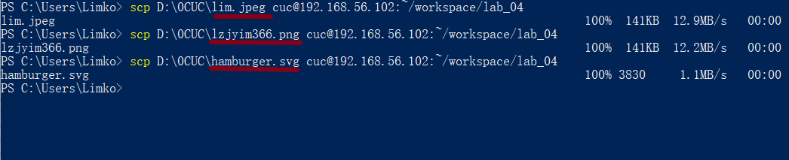

首先，将三张测试图片传输至虚拟机中。

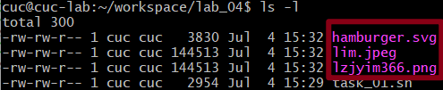

可以看到三张图片都正确传输了。

接着依次进行测试，过程及结果如下：

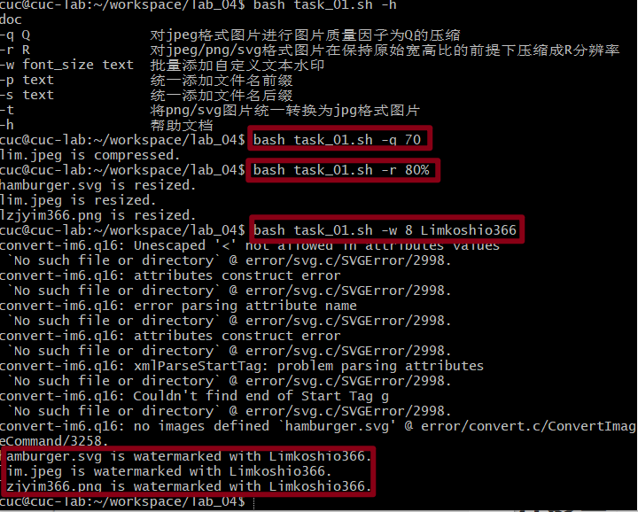

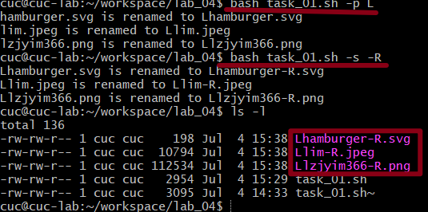

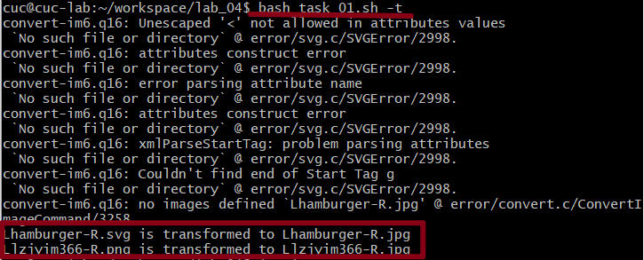

## 2.任务二：用bash编写一个文本批处理脚本，对以下附件分别进行批量处理完成相应的数据统计任务：

### 2.1 2014世界杯运动员数据

- 统计不同年龄区间范围（20岁以下、[20-30]、30岁以上）的球员**数量**、**百分比**
- 统计不同场上位置的球员**数量**、**百分比**
- 名字最长的球员是谁？名字最短的球员是谁？
- 年龄最大的球员是谁？年龄最小的球员是谁？

#### 2.1.1获取数据文件

首先，使用wget命令将.tsv文件下载到本地。

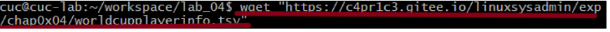

#### 2.2.2脚本编写

代码如下：

```bash
#!/usr/bin/env bash
function help {
    echo "doc"
    echo "-s                 统计不同年龄区间范围（20岁以下、[20-30]、30岁以上）的球员数量、百分比"
    echo "-p                 统计不同场上位置的球员数量、百分比"
    echo "-n                 名字最长的球员是谁？名字最短的球员是谁？"
    echo "-a                 年龄最大的球员是谁？年龄最小的球员是谁？"
    echo "-h                 帮助文档"
}

# 统计不同年龄区间范围（20岁以下、[20-30]、30岁以上）的球员数量、百分比
function countAge {
	#指定输入文件折分隔符 \t
    awk -F "\t" '
        BEGIN {a=0; b=0; c=0;}
        $6!="Age" {
            if($6>=0&&$6<20) {a++;}
            else if($6<=30) {b++;}
            else {c++;}
        }
        END {
            sum=a+b+c;
            printf("Age\tCount\tPercentage\n");
            printf("<20\t%d\t%f%%\n",a,a*100.0/sum);
            printf("[20,30]\t%d\t%f%%\n",b,b*100.0/sum);
            printf(">30\t%d\t%f%%\n",c,c*100.0/sum);
        }' worldcupplayerinfo.tsv
}

# 统计不同场上位置的球员数量、百分比
function countPosition {
    awk -F "\t" '
        BEGIN {sum=0}
        $5!="Position" {
            pos[$5]++;
            sum++;
        }
        END {
            printf("    Position\tCount\tPercentage\n");
            for(i in pos) {
                printf("%13s\t%d\t%f%%\n",i,pos[i],pos[i]*100.0/sum);
            }
        }' worldcupplayerinfo.tsv
}

# 名字最长的球员是谁？名字最短的球员是谁？
# 考虑并列
function maxName {
    awk -F "\t" '
        BEGIN {mx=-1; mi=1000;}
        $9!="Player" {
            len=length($9);
            names[$9]=len;
            mx=len>mx?len:mx;
            mi=len<mi?len:mi;
        }
        END {
            for(i in names) {
                if(names[i]==mx) {
                    printf("The longest name is %s\n", i);
                } else  if(names[i]==mi) {
                    printf("The shortest name is %s\n", i);
                }
            }
        }' worldcupplayerinfo.tsv
}

# 年龄最大的球员是谁？年龄最小的球员是谁？
# 考虑并列
function maxAge {
    awk -F "\t" '
        BEGIN {mx=-1; mi=1000;}
        NR>1 {
            age=$6;
            names[$9]=age;
            mx=age>mx?age:mx;
            mi=age<mi?age:mi;
        }
        END {
            printf("The oldest age is %d, who is\n", mx);
            for(i in names) {
                if(names[i]==mx) { printf("%s\n", i); }
            }
            printf("The youngest age is %d, who is\n", mi);
            for(i in names) {
                if(names[i]==mi) { printf("%s\n", i); }
            }
        }' worldcupplayerinfo.tsv
}


while [ "$1" != "" ];do
    case "$1" in
        "-s")
            countAge
            exit 0
            ;;
        "-p")
            countPosition
            exit 0
            ;;
        "-n")
            maxName
            exit 0
            ;;
        "-a")
            maxAge
            exit 0
            ;;
        "-h")
            help
            exit 0
            ;;
    esac
done
```

测试结果如下：

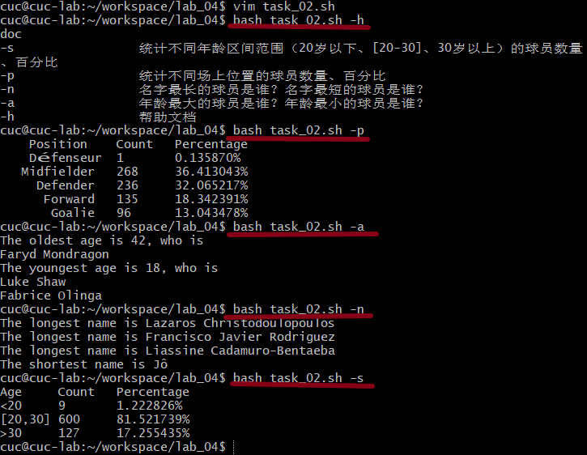

## 2.2 Web服务器访问日志

- 统计访问来源主机TOP 100和分别对应出现的总次数
- 统计访问来源主机TOP 100 IP和分别对应出现的总次数
- 统计最频繁被访问的URL TOP 100
- 统计不同响应状态码的出现次数和对应百分比
- 分别统计不同4XX状态码对应的TOP 10 URL和对应出现的总次数
- 给定URL输出TOP 100访问来源主机

#### 2.2.1 下载并解压web_log.tsv.7z

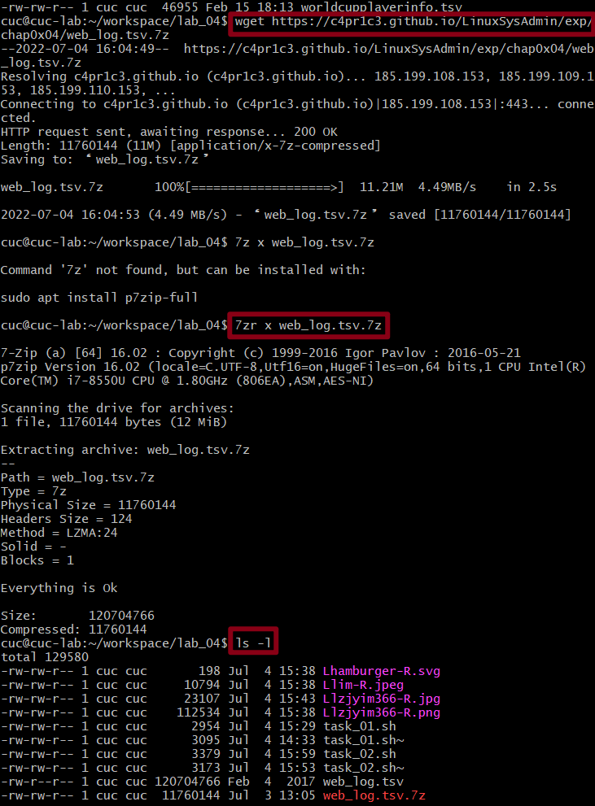

#### 2.2.2 代码编写

```bash
#!/usr/bin/env bash

function help {
    echo "doc"
    echo "-o      统计访问来源主机TOP 100和分别对应出现的总次数"
    echo "-i      统计访问来源主机TOP 100 IP和分别对应出现的总次数"
    echo "-u      统计最频繁被访问的URL TOP 100"
    echo "-c      统计不同响应状态码的出现次数和对应百分比"
    echo "-f      分别统计不同4XX状态码对应的TOP 10 URL和对应出现的总次数"
    echo "-s URL  给定URL输出TOP 100访问来源主机"
    echo "-h      帮助文档"
}

# 来源主机TOP 100
function top100_host {
    printf "%40s\t%s\n" "TOP100_host" "count"
    awk -F "\t" '
    NR>1 {host[$1]++;}
    END { for(i in host) {printf("%40s\t%d\n",i,host[i]);} }
    ' web_log.tsv | sort -g -k 2 -r | head -100
}
# 来源主机TOP 100 IP
function top100_IP {
    printf "%20s\t%s\n" "TOP100_IP" "count"
    awk -F "\t" '
    NR>1 {if(match($1, /^[0-9]{1,3}\.[0-9]{1,3}\.[0-9]{1,3}\.[0-9]{1,3}$/)) ip[$1]++;}
    END { for(i in ip) {printf("%20s\t%d\n",i,ip[i]);} }
    ' web_log.tsv | sort -g -k 2 -r | head -100
}
# URL TOP 100
function top100_URL {
    printf "%55s\t%s\n" "TOP100_URL" "count"
    awk -F "\t" '
    NR>1 {url[$5]++;}
    END { for(i in url) {printf("%55s\t%d\n",i,url[i]);} }
    ' web_log.tsv | sort -g -k 2 -r | head -100
}
# 不同响应状态码百分比
function stateCode {
    awk -F "\t" '
    BEGIN {printf("code\tcount\tpercentage\n");}
    NR>1 {code[$6]++;}
    END { for(i in code) {printf("%d\t%d\t%f%%\n",i,code[i],100.0*code[i]/(NR-1));} }
    ' web_log.tsv
}
# 不同4XX状态码对应的TOP 10 URL
function stateCode4 {
    printf "%55s\t%s\n" "code=403 URL" "count"
    awk -F "\t" '
    NR>1 { if($6=="403") code[$5]++;}
    END { for(i in code) {printf("%55s\t%d\n",i,code[i]);} }
    ' web_log.tsv | sort -g -k 2 -r | head -10


    printf "%55s\t%s\n" "code=404 URL" "count"
    awk -F "\t" '
    NR>1 { if($6=="404") code[$5]++;}
    END { for(i in code) {printf("%55s\t%d\n",i,code[i]);;} }
    ' web_log.tsv | sort -g -k 2 -r | head -10
}
# 输入URL输出TOP 100
function specificURL {
    printf "%40s\t%s\n" "TOP100_host" "count"
    awk -F "\t" '
    NR>1 {if("'"$1"'"==$5) {host[$1]++;} }
    END { for(i in host) {printf("%40s\t%d\n",i,host[i]);} }
    ' web_log.tsv | sort -g -k 2 -r | head -100
}

#根据参数选择功能
while [ "$1" != "" ];do
    case "$1" in
       "-o")
      top100_host
      exit 0
      ;;
       "-i")
      top100_IP
      exit 0
      ;;
       "-u")
      top100_URL
      exit 0
      ;;
       "-c")
      stateCode
      exit 0
      ;;
       "-f")
      stateCode4
      exit 0
      ;;
       "-s")
      specificURL "$2"
      exit 0
      ;;
       "-h")
      help
      exit 0
      ;;
    esac
done
        
```

#### 2.2.3测试结果

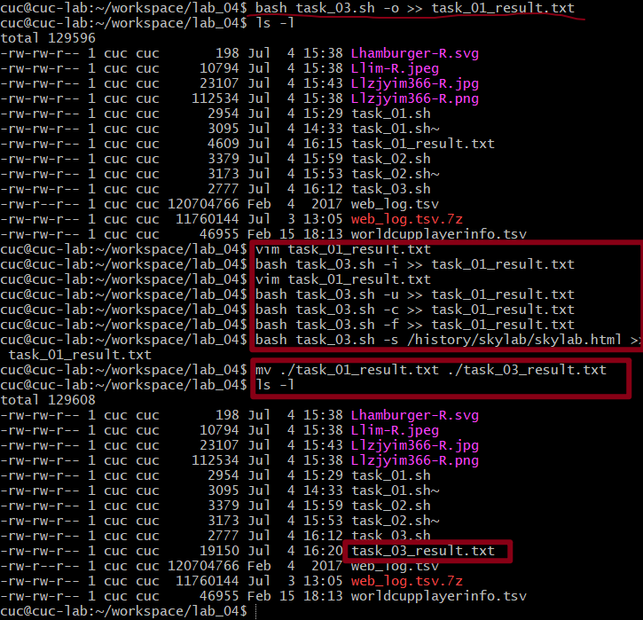


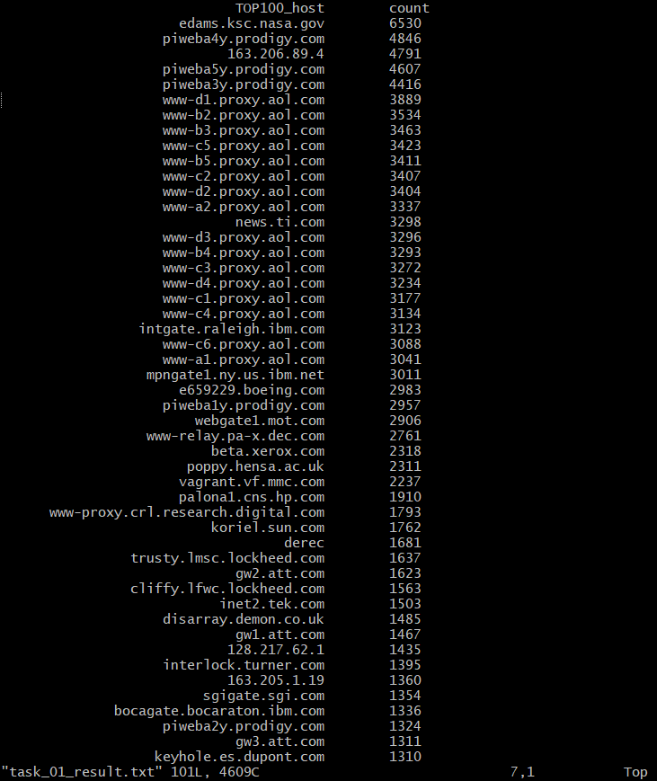

结果文件的部分截图如上，完整内容附在了本分支的`task_03_result.md`中。

## 3.遇到的困难

- 问题1：Git Bash不显示中文的问题

- 解决：在Git Bash的“Options”选项中设置Text-Locale为“zh_CN”, Character set选择“UTF-8”

  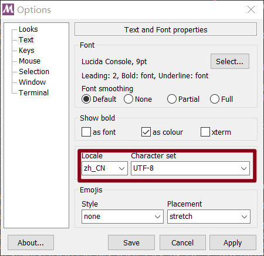

- 问题2：想要使用Travis CI的服务，但是在进行部署的时候被提示“因为当前用户的分数为负，所以Build被禁用了”，不知道该怎么解决这个问题

  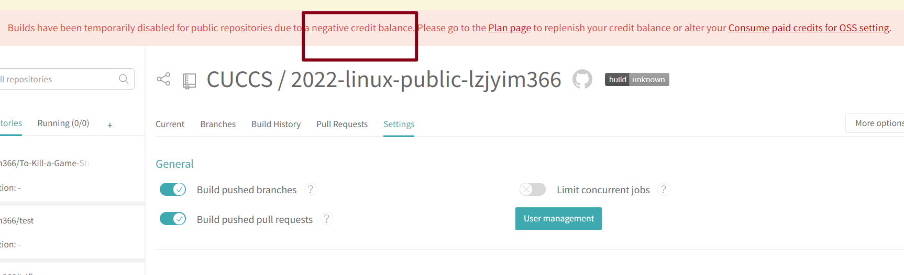

  查阅资料发现，用免费方案，系统会赠送一些积分（这个积分不会刷新，是一次性的）。Linux 机器上每分钟消耗 10 积分，我在不知不觉的情况下把这些积分给用光了，所以无法继续免费使用构建服务。需要花 15 刀来购买 25000 积分，也可以每月用至少 65 刀订阅来获得无限的构建时间，但是这对我来说太过昂贵了，所以我只好放弃了使用Travis CI（以实验报告被扣分的代价，唉……）。

## 4.参考链接

[师哥/师姐的chap0x04作业](https://github.com/CUCCS/2021-linux-public-Stephaniesuu/blob/chap0x04/)

[让bash可以显示中文](https://blog.csdn.net/tengh/article/details/12617705)

[Travis CI 改变收费策略了，还在使用免费方案的朋友们需要注意了](http://www.caotama.com/644543.html)