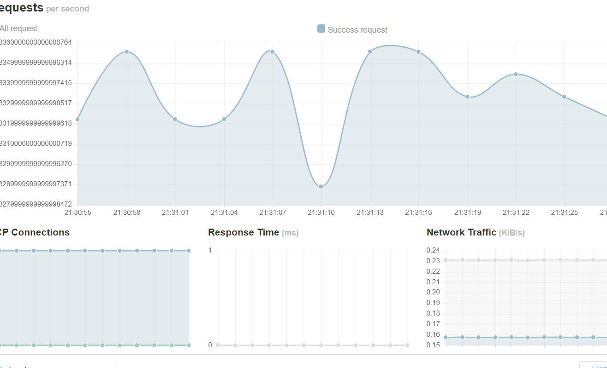
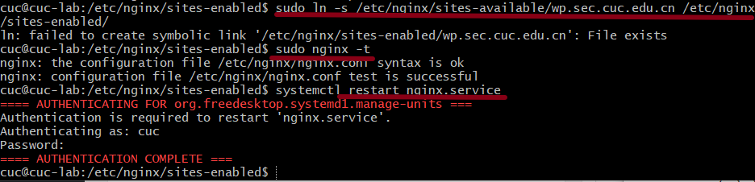

# ch0x05

## 0.实验环境

系统环境：Windows 10 家庭中文版 21H2 内部版本号19044.1586

虚拟机软件版本：VirtualBox 6.1.32 r149290（Qt 5.6.2）

部分情况下在Power Shell中使用SSH连接到虚拟机进行实验。

## 1.实验要求

### 1.1.基本要求

- 在一台主机（虚拟机）上同时配置Nginx和VeryNginx
  - VeryNginx作为本次实验的Web App的反向代理服务器和WAF
  - PHP-FPM进程的反向代理配置在nginx服务器上，VeryNginx服务器不直接配置Web站点服务
- 使用[Wordpress](https://wordpress.org/)搭建的站点对外提供访问的地址为： http://wp.sec.cuc.edu.cn
- 使用[Damn Vulnerable Web Application (DVWA)](http://www.dvwa.co.uk/)搭建的站点对外提供访问的地址为： http://dvwa.sec.cuc.edu.cn

### 1.2.安全加固要求

- 使用IP地址方式均无法访问上述任意站点，并向访客展示自定义的**友好错误提示信息页面-1**
- [Damn Vulnerable Web Application (DVWA)](http://www.dvwa.co.uk/)只允许白名单上的访客来源IP，其他来源的IP访问均向访客展示自定义的**友好错误提示信息页面-2**
- 在不升级Wordpress版本的情况下，通过定制[VeryNginx](https://github.com/alexazhou/VeryNginx)的访问控制策略规则，**热**修复[WordPress < 4.7.1 - Username Enumeration](https://www.exploit-db.com/exploits/41497/)
- 通过配置[VeryNginx](https://github.com/alexazhou/VeryNginx)的Filter规则实现对[Damn Vulnerable Web Application (DVWA)](http://www.dvwa.co.uk/)的SQL注入实验在低安全等级条件下进行防护

### 1.3.VeryNginx配置要求

- [VeryNginx](https://github.com/alexazhou/VeryNginx)的Web管理页面仅允许白名单上的访客来源IP，其他来源的IP访问均向访客展示自定义的**友好错误提示信息页面-3**

- 通过定制

  VeryNginx

  的访问控制策略规则实现：

  - 限制DVWA站点的单IP访问速率为每秒请求数 < 50
  - 限制Wordpress站点的单IP访问速率为每秒请求数 < 20
  - 超过访问频率限制的请求直接返回自定义**错误提示信息页面-4**
  - 禁止curl访问

## 2.实验内容

### 2.1 基本要求

2.1.1 下载所需的各种包

- 修改宿主机和虚拟机中的host

```
192.168.56.102 vn.sec.cuc.edu.cn
192.168.56.102 dvwa.sec.cuc.edu.cn
192.168.56.102 wp.sec.cuc.edu.cn
```


- 安装Nginx和PHP-FPM组件、重启PHP-FPM进程

```bash
sudo apt update && sudo apt install nginx
sudo apt install php-fpm php-mysql php-curl php-gd php-intl php-mbstring php-soap php-xml php-xmlrpc php-zip
sudo systemctl restart php7.4-fpm
```

- 安装VeryNginx

  - 安装git

    ```bash
    sudo apt install git
    ```

  - 下载VeryNginx包

    ```bash
    git clone https://github.com/alexazhou/VeryNginx.git
    ```

  - 安装各种依赖

    ```bash
    #penssl library
    sudo apt-get install libssl-dev -y
    #pcre
    sudo apt install libpcre3 libpcre3-dev -y
    #build-essential
    sudo apt install build-essential -y
    #zlib
    sudo apt install zlib1g-dev -y
    #gcc
    sudo apt install gcc -y
    #make
    sudo apt install make -y
    ```

  - 关闭nginx

    ```bash
    cd VeryNginx
    sudo nginx -s stop
    ```

  - 安装veryNginx

    ```bash
    sudo python3 install.py install
    ```

- 下载wordpress

  ```bash
  #建立目录
  sudo mkdir /var/www/html/wp.sec.cuc.edu.cn
  cd /var/www/html/wp.sec.cuc.edu.cn
  # 下载
  sudo wget https://wordpress.org/wordpress-4.7.zip
  # 下载p7zip-full并解压刚刚wget的WordPress4.7
  sudo apt install p7zip-full -y
  7z x wordpress-4.7.zip
  ```

- 安装MySQL

  ```bash
  sudo apt install mysql-server -y
  ```

- 下载DVWA

  ```bash
  #创建目录
  sudo mkdir /var/www/html/dvwa.sec.cuc.edu.cn
  #git clone
  git clone https://github.com/digininja/DVWA.git
  ```

至此，所需的安装全部结束：


2.进行配置

- 配置veryNginx

  ```bash
  sudo vim /opt/verynginx/openresty/nginx/conf/nginx.conf
  ```

  修改veryNginx的配置文件，将默认用户和网卡地址改为正确的值。

  

  

  其中用户需要修改为www-data。

  修改成功后，启动服务

  ```bash
  sudo /opt/verynginx/openresty/nginx/sbin/nginx
  ```


  通过`192.168.56.102/verynginx/index.html`来访问verynginx。

  进入登录界面：

  

  登录后，结果如下：

  

  证明verynginx已经成功安装。

- 配置Wordpress

  - 新建数据库

    ```sql
    sudo mysql
    #建新表，设置字符集
    create database wordpress DEFAULT CHARACTER SET utf8 COLLATE utf8_unicode_ci;
    #新建用户，授权
    create user 'limko'@'localhost' IDENTIFIED BY 'cuc';
    grant all on wordpress.* to 'limko'@'localhost';
    #刷新权限，退出
    flush privileges;
    exit;
    #重启服务
    sudo systemctl restart mysql.service
    ```

    

    刷新权限输错了一次，有点尴尬。

  - 修改wp-config.php

    将wp-config.php中数据库、用户、密码的设置修改如下：

    

  - 修改nginx配置

    将配置文件`/etc/nginx/sites-available/wp.sec.cuc.edu.cn`的内容修改如下：

    

  - 建立软连接，验证成果

    ```bash
    # 语法检查    
    sudo nginx -t
    # 建立软链接
    sudo ln -s /etc/nginx/sites-available/wp.sec.cuc.edu.cn /etc/nginx/sites-enabled/
    # 重新加载配置文件
    sudo nginx -s reload
    ```

    

    可以看到配置文件语法正确。

    在宿主机浏览器中访问站点：

    

    输入信息后点击安装，安装成功：

    

- 配置DVWA

  - 建立DVWA数据库

    ```sql
    sudo mysql
    #建新表，设置字符集
    create database dvwa DEFAULT CHARACTER SET utf8 COLLATE utf8_unicode_ci;
    #新建用户，授权
    create user 'limko'@'localhost' IDENTIFIED BY 'cuc';
    grant all on wordpress.* to 'dvwa'@'localhost';
    #刷新权限，退出
    flush privileges;
    exit;
    #重启服务
    sudo systemctl restart mysql.service
    ```

  - 配置php

    ```bash
    sudo mv config.inc.php.dist config.inc.php
    ```

    首先将/var/www/html/dvwa.sec.cuc.edu.cn/config/目录下的config.inc.php.dist改名

    

    然后修改/etc/php/7.4/fpm/php.ini令：

    ```ini
    allow_url_include = on
    allow_url_fopen = on
    safe_mode = off
    display_errors = off
    ```

  - 重启php

    ```bash
    systemctl restart php7.4-fpm.service
    ```

  - 分配所有权

    ```bash
    sudo chown -R www-data.www-data /var/www/html/dvwa.sec.cuc.edu.cn
    ```

    对www-data用户组授权。

  - 配置服务器

    在 /etc/nginx/sites-available/dvwa.sec.cuc.edu.cn这个配置文件中，写入

    ```bash
    # 写入
    server {
        listen 8080 default_server;
        listen [::]:8080 default_server;
    	
        root /var/www/html/dvwa.sec.cuc.edu.cn;
        index index.php index.html index.htm index.nginx-debian.html;
        server_name dvwa.sec.cuc.edu.cn;
    
        location / {
            #try_files $uri $uri/ =404;
            try_files $uri $uri/ /index.php$is_args$args;  
        }
    
        location ~ \.php$ {
            include snippets/fastcgi-php.conf;
            fastcgi_pass unix:/var/run/php/php7.4-fpm.sock;
        }
    
        location ~ /\.ht {
            deny all;
        }
    }
    ```

  - 创建软链接、检查语法、重启服务

    ```bash
    sudo ln -s /etc/nginx/sites-available/dvwa.sec.cuc.edu.cn /etc/nginx/sites-enabled/ #创建软链接
    sudo nginx -t
    systemctl restart nginx.service
    ```

  - 测试连接效果

    

    可以看到，dvwa已成功配置

    

### 2. 安全加固要求

- 反向代理设置过程：

  - Request Matcher中：

  

  添加dvwa和wp的host

  - Proxy Pass中：

  

  添加dvwa、wp所需的up stream和proxy pass

- 使用IP地址方式均无法访问上述任意站点，并向访客展示自定义的友好错误提示信息页面-1
  - 在Request Matcher中：

    使用正则表达式筛选出用IP来访问网页的主机名

    

  - 在Response中：

    添加友好错误提示页面需要显示的规则

    

    提示“你不能用ip来访问这个网页”

  - 在Filter中：

    为ip_match添加相应的反馈规则，当符合ip_match时，就block该主机，并返回错误代码403，提示“你不能通过ip地址来访问”

    

  - 最终效果

    

    使用ip地址来访问verynginx主页时，提示了我们希望提示的友好错误信息。

# 3.问题

- 安装nginx后，为了避免它的安装影响到后续操作，使用sytemctl将nginx服务停止了，但是后面忘记了。导致想要检验nginx是否安装成功的时候一直失败

  - 解决：

    ```bash
    sudo systemctl start nginx
    sudo systemctl reload nginx #重新加载配置文件
    ```

    重新把nginx服务开启，随后观察到nginx安装成功。

    

- 一开始配置之后，尝试连接到`http://192.168.56.102:8080/wp-admin/setup-config.php`，失败

  

  - 解决：我发现自己在`/etc/nginx/sites-enabled`这个文件夹下，写了两个配置文件，一个叫`wp`，一个叫`wp.sec.cuc.edu.cn`其中，wp里面没有包含wordpress对应的端口。而我在建立软连接的时候，建立的是wp的连接：

    

    所以说不会正确地出现wordpress网站。我在正文中，将软链接命令进行了修改，于是可以成功访问wordpress了。

- 在配置dvwa，修改php.ini时，文件太长了。我忘记了vim的查找命令是什么，一开始用肉眼找，后面发现是在是不现实。

  - 解决：查阅资料，发现在vim中输入`/`可以进入查找模式，直接查找内容。
  - 除此之外，`:n`n为行数，可以跳到需要的行数。

## 4.参考链接

[verynginx中文文档](https://blog.51cto.com/u_6207455/3344924)

[在ubuntu中修改hosts配置不生效](https://cloud.tencent.com/developer/article/1932402)

[师哥/师姐往年的作业](https://github.com/CUCCS/2021-linux-public-kal1x/blob/chap0x05/chap0x05/%E7%AC%AC%E4%BA%94%E6%AC%A1%E5%AE%9E%E9%AA%8C.md)